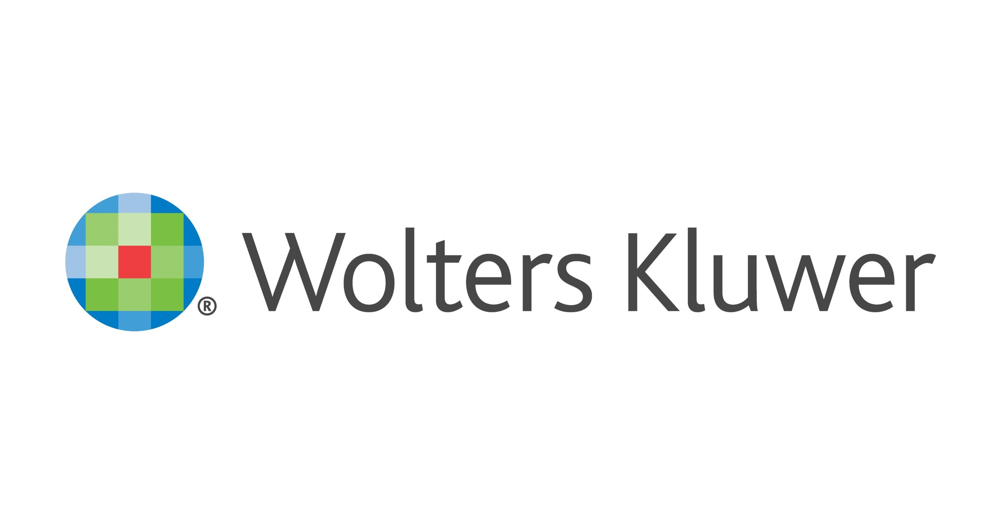

<h1 style="color: green; font-size: 60px">Shikhar Singh.</h1>
<h3 style="font-size: 24px">Just an overall chill guy 🚶🏾‍♂️ </h3> 
Pronounced '*Shik-Her-Sing*'. The name *Shikhar* is derived from 'shikhara', which means 'mountain peak' in Sanskrit. *Singh* is derived from 'simha', meaning 'lion'
 
<h1 style="color:green;"> My degrees🧑🏽‍🎓</h1>					       		
- Masters in Computer Science from the University of Southern California | Los Angeles *(Graduated Dec' 24)*		        		
- Bachelors in Computer Science from Vellore Institute of Technology | Vellore, India *(Graduated Sep' 20)*

   
  

<h1 style="color:green;">Where I've worked🧑🏾‍💻</h1>	
#### **GenAI Product Manager Intern @ Delet, Los Angeles (_May'24 - Aug'24_)**

  

I probably had the most fun I've ever had building software during my 3 month internship at Delet. I led a team of 4 devs as a PM+Dev to launch a GenAI Leasing Agent feature for the Delet app. Read further about my experience <a href = "https://www.linkedin.com/posts/shikharsingh167_product-productmanagement-pm-activity-7222910729174097920-PczX?utm_source=share&utm_medium=member_desktop" text="_bkank">here!</a>
  
#### **Associate Product Manager @ Wolters Kluwer, Chennai (_Jan'20 - Dec'22_)**

  

I joined WK as a Product Analyst fresh out of college and eventually took up an APM role there for a SaaS product in the Legal Services domain. The 3 years I spent there were transformative to say the least. I worked on high-impact projects that generated millions for the organization and managed to develop strong professional relationships along the way 😁
  
#### **Data Science Intern @ Mphasis, Bengaluru (_May'19 - Jul'19_)**

  

Mphasis was my first professional experience during my junior year of undergrad, and one I’m incredibly proud of. I learned new technology, worked with real-world datasets, and delivered impactful results. A highlight was presenting my project documentation to my manager and leaders, who were so impressed they showcased it to the entire team. I still keep two copies of my project report to this day—you can check it out <a href = "https://github.com/Shikhar167/Research-Projects-and-Awards/blob/master/Mphasis_Data_Science_Project/Mphasis_Internship.pdf" text="_blank">here!</a>
  

<h1 style="color:green;">Stuff I've built🤖</h1>	

### **LogDetect.AI**

   <iframe width="500" height="400" style="border-radius:15px" src="https://www.youtube.com/embed/eekGkLPNUWY?si=YeXKuR5t_MUIO-t9" title="YouTube video player" frameborder="0" allow="accelerometer; autoplay; clipboard-write; encrypted-media; gyroscope; picture-in-picture; web-share" referrerpolicy="strict-origin-when-cross-origin" allowfullscreen></iframe>

Remember all the times you missed a meeting and had to ask multiple people just to know what was decided? What if you had a dedicated AI assistant who you could ask anything about the meetings you missed, and it always gave you up-to-date and accurate answers? LogDetect.AI is exactly that. <a href = "https://github.com/Shikhar167/LogDetect.AI" text="_blank">Check it out here!</a>
  

### **Best XI**

 <iframe width="500" height="400" style="border-radius:15px" src="https://www.youtube.com/embed/7YkEAGLmHzQ?si=YF3LSgnemMVltgaw" title="YouTube video player" frameborder="0" allow="accelerometer; autoplay; clipboard-write; encrypted-media; gyroscope; picture-in-picture; web-share" referrerpolicy="strict-origin-when-cross-origin" allowfullscreen></iframe>

Scraped a bunch of data from the IPL 2024 cricket tournament, performed data cleaning and transformations and created a swanky Tableau dashboard that lets you pick the best XI based on your set criteria. Had a lot of fun working on this! <a href = "https://github.com/Shikhar167/USC/tree/main/IPL2024" text="_blank">Project Link!</a>
 
<h3>...and a lot more <a href = "https://github.com/Shikhar167" text="_blank">here!</a></h3>
 

<h1 style="color:green;">Other Avenues 🌟</h1>
### **Director - Entrepreneurship Cell, VIT**

 

### **Co-founder - ”Nirvaah” (Translation : Subsistence)**

 

### Delegate - Entrepreneurship Camp, Kuala Lumpur

  

<h1 style="color: green; font-size: 50px">The scrolling stops here.</h1>
If you'd like to know more about me, or just chat in general, send me a message on <a href = "https://www.linkedin.com/in/shikharsingh167/" text="_blank">LinkedIn</a> or email me at <b>ss.singhshikhar@gmail.com</b>. Ciao!!👋🏽

