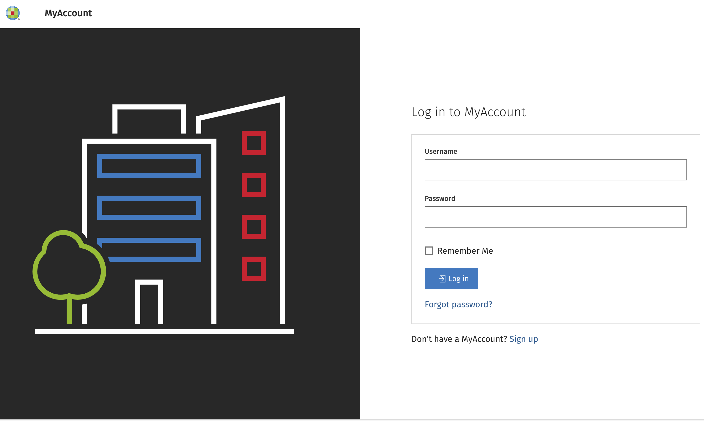
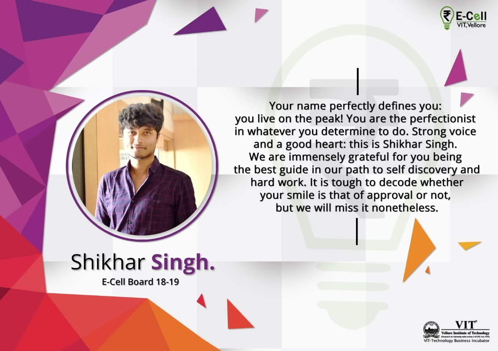
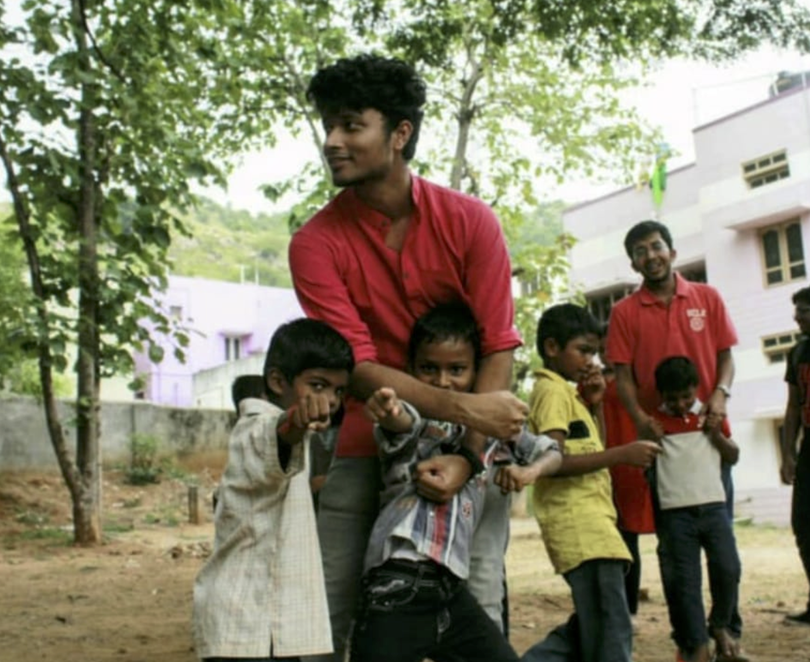
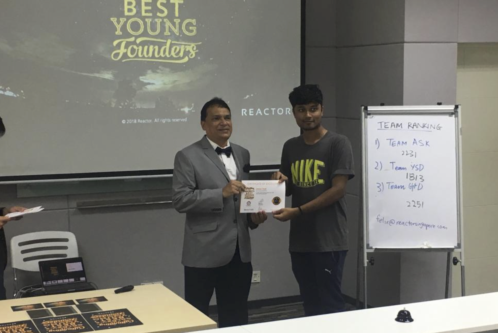
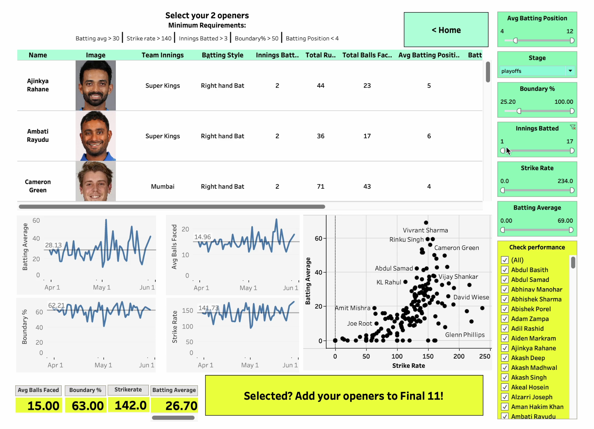

<h1 style="color: green; font-size: 50px">Shikhar Singh.</h1>
<h3>Just an overall chill guy 🚶🏾‍♂️ </h3> 
Pronounced '*Shik-Her-Sing*'. The name *Shikhar* is derived from 'shikhara', which means 'mountain peak' in Sanskrit. *Singh* is derived from 'simha', meaning 'lion'

<h2 style="color:green;"> My degrees (so far...)</h2>					       		
- Masters in Computer Science from the University of Southern California | Los Angeles *(Graduated Dec'24)*		        		
- Bachelors in Computer Science from Vellore Institute of Technology | Vellore, India *(Graduated Sep'20)*

<h2 style="color:green;">Where I've worked</h2>		
**Technical Product Analyst @ Wolters Kluwer (_Jan 2020 - Dec 2022_)**
- Defined detailed requirements for 25+ use-cases as a product specialist, serving 58 US jurisdictions
- Revised 35+ use-cases for a web app to sustain an influx of 115k new users through an extensive GAP analysis
- Published process flows for 3 enterprise apps, standardizing documentation, and aiding KT across the organization
- Issued documentation on the O2C flow in SAP ERP System, assisting 5 teams with data source field mapping
- Created an interactive analytics tool in Splunk that mined real-time app logs and described 15+ use-cases
- Diagnosed production issues and aided incident management using Splunk and MySQL over 28 monthly sprints
- Crafted the integration of virus detection workflow into a web application, achieving 35 uploaded-file-scans/minute
- Partnered with solution architects to design a multi-cloud DR strategy in AWS/Azure, impacting 74k users

**Data Science Intern @ Mphasis Limited (_May 2019 - June 2019_)**
- Conducted extensive research on process mining in R, experimenting on 500K rows of in-patient activity data
- Proposed Graph DB as an effective store for join-intensive activity data, to accelerate response times by 50%
- Implemented a POC in the NeO4j GraphDB, generating mined process graph and improving query times by 20%
- Optimized query performance using CypherQL to improve 15 methods of unearthing KPIs, enhancing readability
- Refined process graph visualization using vis.js with 3 adaptive KPI indicators and animated edge traversal
- Applied Random Forest on healthcare data to predict users’ next activity in the journey with an accuracy of 70%
  

# Projects
## SOP Legal Documents Intake Portal - Pandemic Preparedness and Digital Transformation 

[Link to website](https://intake.ctcorporation.com/intakeportal/#/login)
- Implemented 25 use-cases and enhancements into a customer-facing java application across 14 sprints impacting 58 US jurisdictions
- Designed a multi-cloud system architecture in AWS and Azure, facilitating a more secure Disaster Recovery strategy
- Designed the inclusion of OCR and Virus-scan use-cases to the system, supervised by the Principal Solution Architect of the firm  

## User Base Migration to a Central Account Management Portal 

[Link to website](https://myaccount.es.wolterskluwer.com/myaccount/#/login)
- Modified >35 use-cases for a portal to accommodate an influx of 115,000 new active users across Asia, North America, and Europe
- Implemented modules like Single Sign-On and Multi-Factor Authentication to strengthen application security

## Startup-VIT : Ideation Platform

[Link to project](https://github.com/Shikhar167/Projects_VIT_Vellore/blob/master/Student_Chapter_Projects/Ideation_Platform_Startup_VIT.pdf)
- Conducted user interviews with 10 campus startups and identified key requirements in order to achieve incubation
- Designed a web portal to facilitate campus startups in ideation, recruitment, and mentorship activities
- On-boarded 6 startups who used the portal to hire 50% of their new recruits, accelerating prototype development  

# Leadership and Volunteer Experience
## Director - Entrepreneurship Cell, VIT

- Built an ecosystem for the development of startups on-campus enabling 28 startups in fundraising and incubation
- Organized Entrepreneurship Summit 2019, attended by 2500+ participants and 45 tech startups from South India  

## Co-founder - ”Nirvaah” (Translation : Subsistence)

- Started an initiative to empower rural women of Vellore to open shops and promote their products within campus
- Promoted a canteen named “Mathi” on campus, run entirely by elderly women and boosted sales by 35%  

## Delegate - Entrepreneurship Camp, Malaysia

- Selected among 300 students for the Reactor E-Camp Design and Prototyping Contest organized in KL, Malaysia
- Won the prototyping contest by designing a MVP for a peer-graded platform focused on upskilling teachers  

## MediumGEN - "Medium" Style Articles using Large Language Models

[Link to project](https://github.com/rs2309/MediumGEN)
- Fine tuned GPT 2 and LLAMA 2 using Low Rank Adaption (LoRA) on a dataset of 200K Medium Articles
- Devised a weighted scoring mechanism, to assess coherence, tone, accuracy and writing style on a 10-pt scale
- Experimented with prompting techniques to outscore baseline models by 15% across 40 generated articles  

## IPL2024 - Data Driven Player Selector Portal

[Link to youtube demo](https://www.youtube.com/watch?v=7YkEAGLmHzQ&t=2s&ab_channel=ShikharSingh)
- Crafted a BeautifulSoup web-scraper for automated IPL 2023 data collection from 10 teams and 74 matches
- Processed, cleaned, and transformed data using Pandas and identified 8 KPIs to evaluate player performance
- Curated Best XI from player stats using 8 extracted KPIs, showcased on an interactive Tableau dashboard  

# Awards, Honors and Accolades
## Merit Scholarship | VIT Vellore
[View Credential](https://github.com/Shikhar167/Research-Projects-and-Awards/blob/master/Accolades/Shikhar%20Singh%20-%20Merit%20Scholarship.pdf)
- Rewarded scholarship across 4 years of UG study in recognition of VITEEE’16 rank (top 3.5%) and excellent academic performance

## Chairman’s Award | Wolters Kluwer
[View Credential](https://github.com/Shikhar167/Research-Projects-and-Awards/blob/master/Accolades/GIA%20win%20cred.png)
- Received the prestigious enterprise-wide Chairman's Award for digital transformation of a critical application during the pandemic
  

